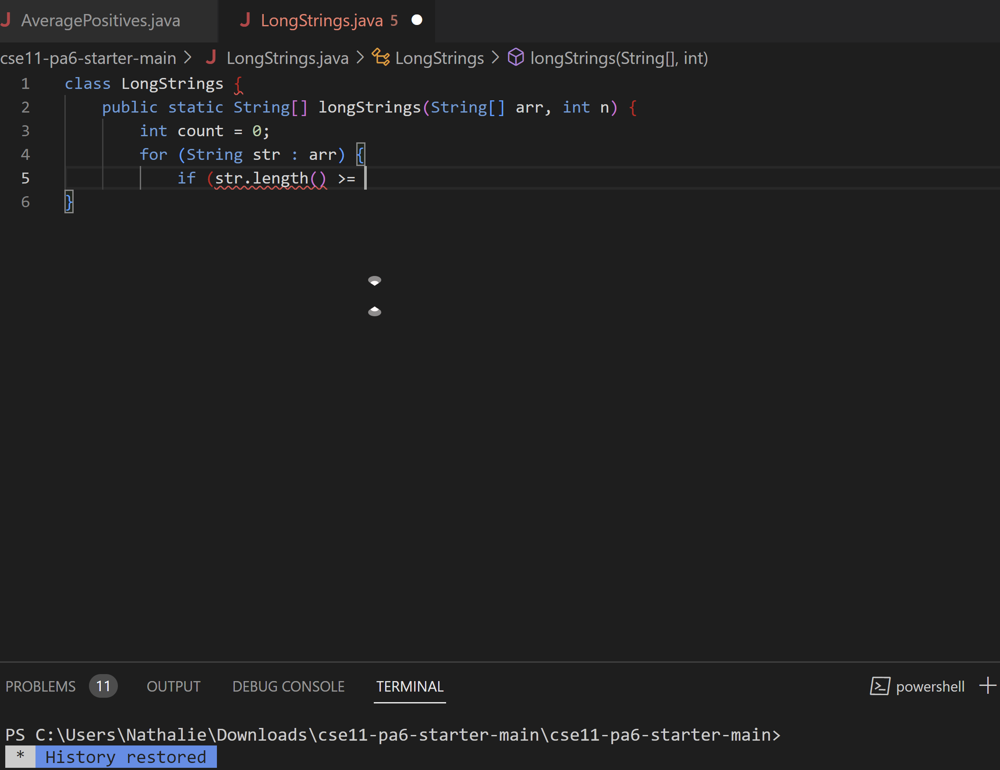
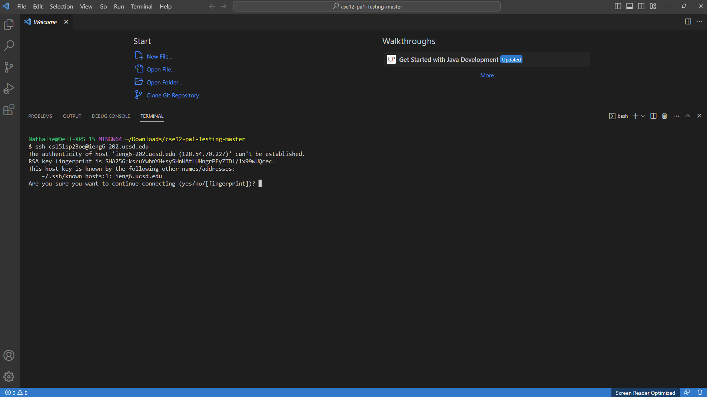
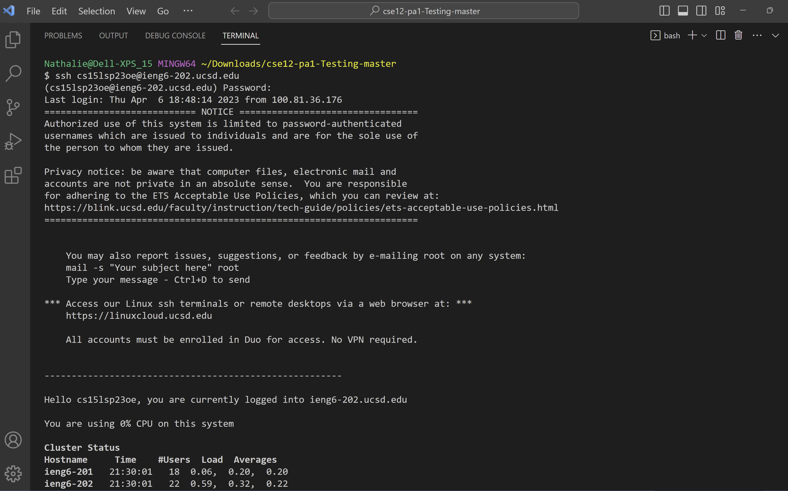

# Lab Report 1
> I am going to attempt to create a tutorial for incoming 15L studens to log into course specific accounts like `ieng6`

The following are the steps I will be coverig:
1. Installing VScode
2. Remotely Connecting
3. Trying some Commands

## Installing VScode
--- 

Install Visual Sutio Code with the provided link below, and follow the steps to install. 

[Visual Studio Code]("https://code.visualstudio.com/")

Once you finish installing VScode, open the application. You should see a screen like this.

 

## Remotely Connecting
---
Open a new terminal on VS Code by using the built-in terminal/command prompt or by simply uing ctrl + shift + ` 

Then type the follwing int your command prompt:

`ssh <username + @ieng6-202.ucsd.edu>`

  
Be sure to replace <username> with **your** username.

once you have types that, press enter.

You should see something like the following:

Then types yes, and click enter again, then retype what you frst wrote in the command prompt this should prompt you to enter your password. Once ou have entered your password, you should see a screen like this.

If you see a page like this, congrats!  You're in. 

## Trying some Commands
Let's try out some commands, here are a few examples we can try:

* cd ~
* cd
* las -lat
* ls <directory\>
* cp <directory\>
* cat <directory\>

Here is an example of how to type them if you are stuck:

